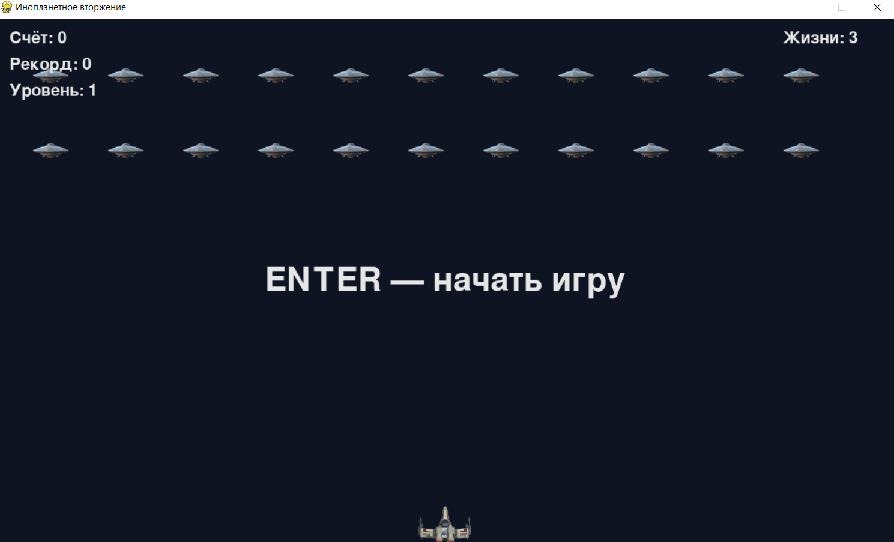
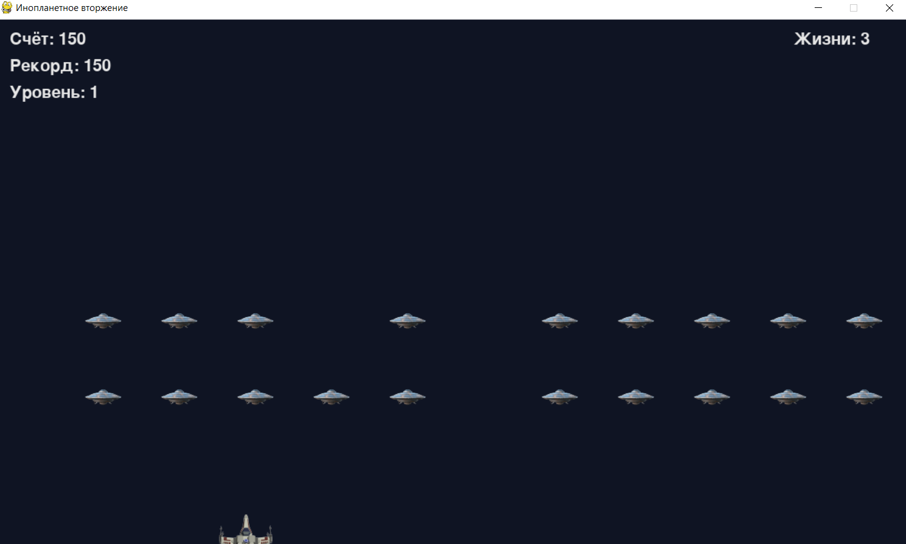
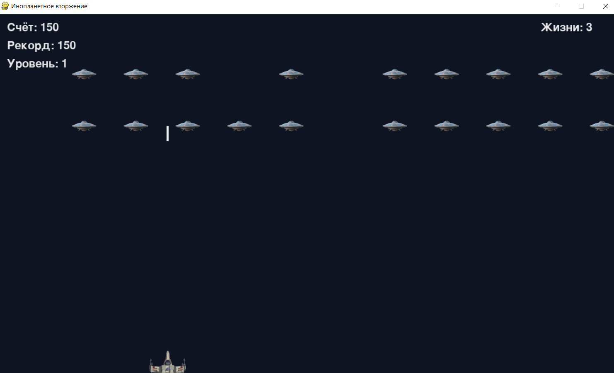
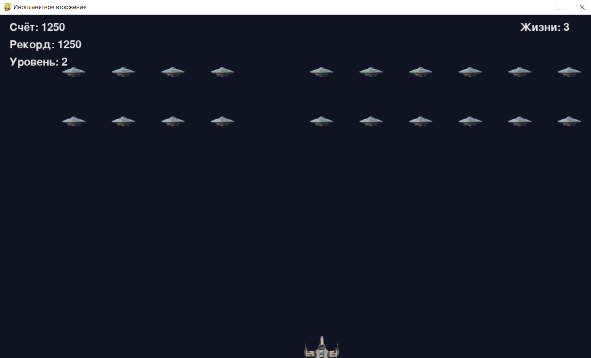
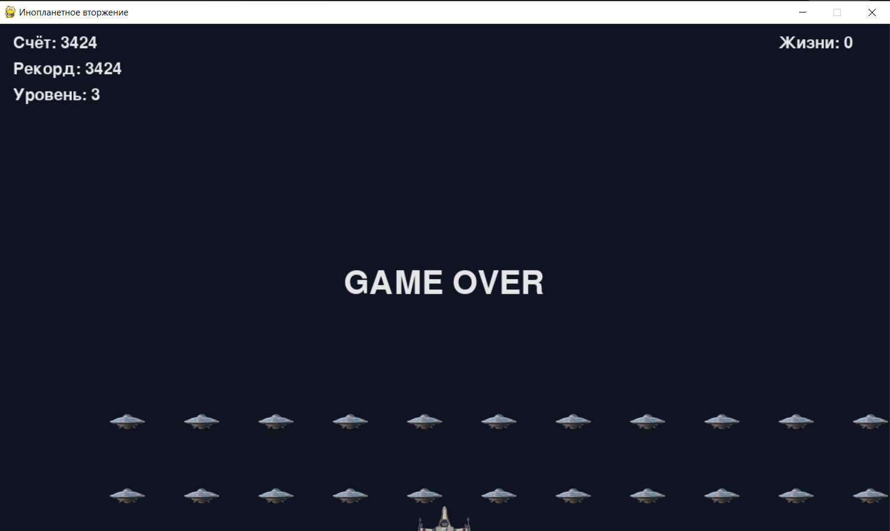

# 👽 Alien Invasion

Базовая 2D-игра **«Инопланетное вторжение»**, разработанная на Python с использованием библиотеки **Pygame**.

Проект выполнен в рамках практической работы №1.

## 🎯 Цель проекта

Разработать 2D-игру, в которой игрок управляет космическим кораблём и должен уничтожить флот инопланетян.

В соответствии с заданием реализованы:

* управление кораблём;
* движение влево и вправо;
* стрельба;
* флот инопланетян;
* движение флота по горизонтали;
* постепенный спуск флота;
* столкновения;
* система жизней;
* очки;
* уровни сложности;
* увеличение скорости игры;
* экран окончания игры.

## 🛠 Используемые технологии

* **Python 3.10+**
* **Pygame 2.6+**
* объектно-ориентированное программирование;
* `pygame.sprite.Group`;
* обработка событий клавиатуры;
* система столкновений;
* игровой цикл.

## 📁 Структура проекта

```text
alien-invasion/
│
├── alien_invasion.py    # Основной файл игры
├── settings.py          # Настройки игры
├── ship.py              # Класс корабля
├── bullet.py            # Класс снаряда
├── alien.py             # Класс инопланетянина
├── game_stats.py        # Статистика и состояние игры
├── scoreboard.py        # Отображение игровой информации
│
├── assets/              # Ресурсы игры
│
├── screenshots/         # Скриншоты работы программы
│
├── pyproject.toml       # Конфигурация Python-проекта
└── README.md            # Документация проекта
```

## ⚙️ Установка

Клонировать репозиторий:

```bash
git clone <URL_РЕПОЗИТОРИЯ>
cd alien-invasion
```

Установить зависимости:

```bash
pip install -e .
```

Или установить Pygame напрямую:

```bash
pip install pygame
```

## ▶️ Запуск

Запустить основной файл:

```bash
python alien_invasion.py
```

Также при установке проекта через `pip install -e .` доступна команда:

```bash
alien-invasion
```

## 🎮 Управление

| Клавиша  | Действие                  |
|----------|---------------------------|
| ←        | Движение корабля влево    |
| →        | Движение корабля вправо   |
| Space    | Стрельба                  |
| Enter    | Начать игру / новую игру  |
| Esc      | Выход                     |

## 🕹️ Игровой процесс

Игрок управляет кораблём, расположенным в нижней части игрового поля.

В верхней части экрана появляется флот инопланетян.

Задача игрока — уничтожить всех пришельцев при помощи снарядов.

После уничтожения всего флота начинается следующий уровень. Скорость игры увеличивается, поэтому каждый следующий уровень становится сложнее.

Если инопланетянин сталкивается с кораблём или достигает нижней границы экрана, игрок теряет одну жизнь.

После потери всех жизней игра заканчивается.

## 📸 Скриншоты

### Начальный экран

<!-- Вставьте сюда скриншот начального экрана -->



### Игровой процесс

<!-- Вставьте сюда скриншот игрового процесса -->



### Стрельба по инопланетянам

<!-- Вставьте сюда скриншот с несколькими снарядами -->



### Новый уровень

<!-- Вставьте сюда скриншот после перехода на новый уровень -->



### Конец игры

<!-- Вставьте сюда скриншот GAME OVER -->



## 📊 Игровая информация

Во время игры отображаются:

* текущий счёт;
* рекорд;
* текущий уровень;
* количество оставшихся жизней.

## 🧩 Архитектура

Проект разделён на несколько независимых модулей.

### `alien_invasion.py`

Главный модуль программы.

Отвечает за:

* создание окна;
* основной игровой цикл;
* обработку событий;
* обновление объектов;
* проверку столкновений;
* создание флота;
* переход между уровнями;
* отрисовку игрового экрана.

### `settings.py`

Содержит параметры игры:

* размер окна;
* цвета;
* скорость корабля;
* скорость пуль;
* скорость пришельцев;
* количество жизней;
* количество одновременно существующих пуль;
* параметры увеличения сложности.

### `ship.py`

Содержит класс `Ship`.

Класс отвечает за:

* положение корабля;
* движение;
* ограничение движения границами экрана;
* возвращение корабля в исходную позицию;
* отрисовку корабля.

### `bullet.py`

Содержит класс `Bullet`.

Отвечает за:

* создание снарядов;
* движение вверх;
* отрисовку;
* удаление снарядов за пределами экрана.

### `alien.py`

Содержит класс `Alien`.

Отвечает за:

* создание инопланетян;
* их положение;
* горизонтальное движение;
* отрисовку.

### `game_stats.py`

Хранит состояние игры:

* количество оставшихся кораблей;
* текущий счёт;
* уровень;
* состояние игры;
* рекорд.

### `scoreboard.py`

Отвечает за отображение игровой информации на экране.

## 💡 Основные принципы

В проекте используется объектно-ориентированный подход.

Игровые сущности представлены отдельными классами:

```text
AlienInvasion
      │
      ├── Settings
      ├── Ship
      ├── Bullet
      ├── Alien
      ├── GameStats
      └── Scoreboard
```

Такое разделение позволяет сделать код более читаемым и упрощает дальнейшее расширение игры.

## 📈 Возможные улучшения

В дальнейшем игру можно расширить:

* добавить графические изображения корабля и пришельцев;
* добавить звуковые эффекты;
* добавить фоновую музыку;
* добавить таблицу рекордов;
* добавить меню настроек;
* добавить различные типы пришельцев;
* добавить стрельбу пришельцев;
* добавить укрытия;
* добавить анимацию взрывов.

## 📚 Практическая работа

Проект основан на требованиях практической работы №1 **«Базовая 2D-игра "Инопланетное вторжение" с использованием Pygame»**.

Основные требования:

* управление кораблём;
* стрельба;
* создание и движение флота;
* обработка столкновений;
* система жизней;
* уровни и увеличение сложности;
* модульная организация исходного кода.

## 👨‍💻 Автор

**Леонид Тоц**

Учебный проект, 2026.
